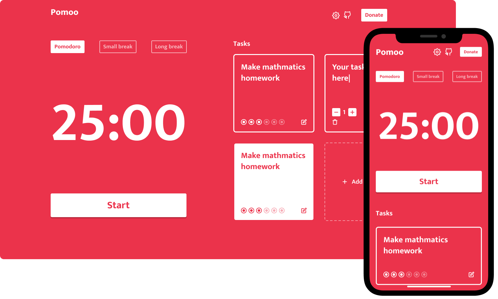

<p align="center">
  
	
  <p align="center">
  A open source pomodoro timer made for everyone!
  </p>
  <p align="center">
  <a href="https://pomoo.vercel.app/">See alive! 😁</a>
  </p>
  <p align="center">
    
  </p>
</p>

<p align="center">
  

  

  

  <br>

  

  <a href="https://www.linkedin.com/in/mathpsantos/">
    
  </a>
</p>

 
# Index

- 🚀 [Project Summary](#%EF%B8%8F-project-summary)
- 👨‍💻️ [Technologies Used](#%EF%B8%8F-technologies-used)
- 📦️ [How to install the project](#%EF%B8%8F-how-to-install-the-project)
- 🤔️ [How can you contribute?](#%EF%B8%8F-how-can-you-contribute)
- 🎨 [Prototype](#%EF%B8%8F-prototype)
- 🔮 [Future Improvements](#%EF%B8%8F-future-improvements)

---
## 🚀 Project Summary

Pomoo is made for everyone, a simple and minimalist pomodoro timer created to help you in your daily and small tasks!
 
---
## 👨‍💻️ Technologies Used

This project was developed using the technologies bellow:


### Website

  - [Next.js](https://nextjs.org/)
  
### Dependencies

  **Website**
  - [React Icons](https://react-icons.github.io/react-icons/)
  - [Styled components](https://styled-components.com/)
  - [Typescript](https://www.typescriptlang.org/)
  
### Code patterns

  - [ESLint](https://eslint.org/)
  - [Prettier](https://prettier.io/)

### IDE

  - [Visual Studio Code](https://code.visualstudio.com/)

---
 
## 📦️ How to install the project

> [Node.js](https://nodejs.org/en/) and [Yarn](https://yarnpkg.com/) or [NPM](https://www.npmjs.com/) are required

To clone the project, use the commands bellow:

```bash
  # Clone the repository
  ❯ git clone https://github.com/MathPSantos/Ecoleta.git

  # Enter directory
  ❯ cd Pomoo
```

### Web

To install dependencies and initialize the project, you can use **Yarn** or **NPM**:

**Using yarn**

```bash
  # Enter web directory
  > cd web

  # Install the dependencies
  ❯ yarn

  # Start the project
  ❯ yarn start
```

**Using npm**

*If you use NPM, delete `yarn.lock` file to see all installed dependencies in the best way.*

```bash
  # Enter web directory
  > cd web
  
  # Install the dependencies
  ❯ npm install

  # Start the project
  ❯ npm start
```

---

## 🎨 Prototype

Pomooo prototype was made at figma and you can see in this [link](https://code.visualstudio.com/)!

---
 
## 🤔️ How can you contribute?

1. `fork` this repository
2. Create a branch with your feature:
   - `$ git checkout -b my_feature`
3. Commit your branch:
   - `$ git commit -m "feature: My new feature"`
4. Submit your branch:
   - `$ git push origin my_feature`
   
---
   
## 🔮 Future Improvements

### Web
  - [ ] Finish Tasks feature
  - [ ] Add settings feature
  - [ ] Add Donate feature
  - [ ] Work on website SEO

---

## License
[MIT License](/LICENSE)

<h4 align="center">
  Made with ❤️ by Matheus Pires Santos! <a href="https://www.linkedin.com/in/mathpsantos/">Get in touch</a> or send a email to matheus.psantos2016@gmail.com!
</h4>
  